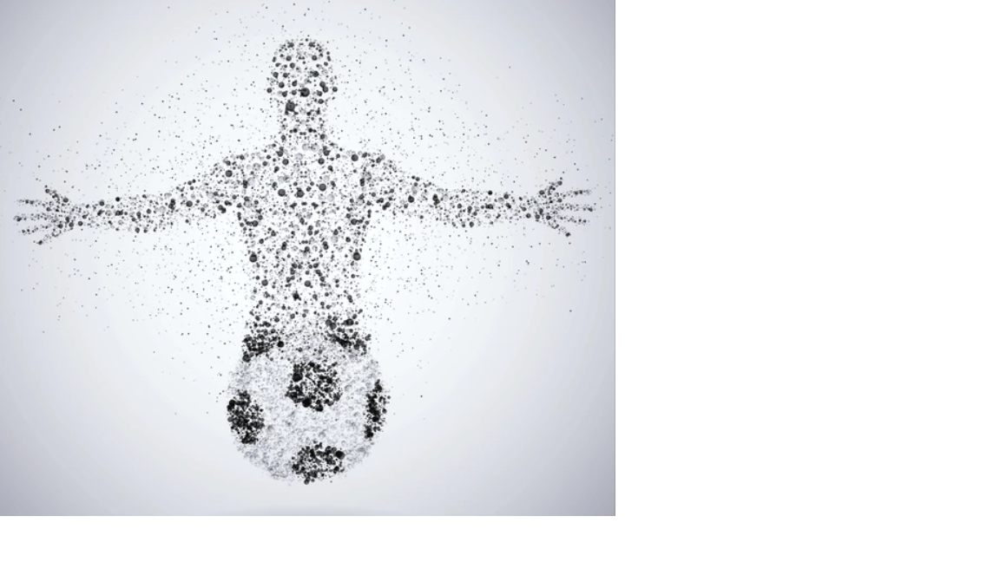

# 📘 FIFA–ICODER Expediente Certificado Final

---

**📅 Fecha de certificación:** 29 de septiembre de 2025  
**🔐 Hash SHA256:** `a4f3d62c8b9e8f23d13f1c71c3e2a8d94d76a30e5fb7e9a41f6c2f89d6e5a1c3`  
**📱 Validación QR Online:** [Verificar Integridad](https://verificacion.openhash.cloud/FIFA-ICODER/a4f3d62c8b9e8f23d13f1c71c3e2a8d94d76a30e5fb7e9a41f6c2f89d6e5a1c3)

---

## ⚽ Bloque FIFA

Este bloque contiene las disposiciones, normativas y lineamientos emitidos por la **Federación Internacional de Fútbol Asociación (FIFA)**, aplicables al marco regulatorio del expediente técnico y disciplinario.

Incluye referencias al Reglamento Disciplinario, Código de Ética, Manual de Cumplimiento FIFA y lineamientos sobre gobernanza y transparencia en procesos sancionatorios.

---

## 🇨🇷 Bloque ICODER

Incluye las directrices institucionales del **Instituto Costarricense del Deporte (ICODER)**, referidas al cumplimiento de políticas públicas, control de competencia y coordinación con entes internacionales.  
Se basa en la Ley Nacional del Deporte y Decretos Ejecutivos vigentes que articulan las competencias administrativas del ICODER frente a organismos internacionales.

---

## ⚖️ Bloque Jurídico

Análisis técnico-forense del marco normativo nacional e internacional aplicable, incluyendo referencias al Código Procesal, Ley de Promoción del Deporte, resoluciones administrativas y jurisprudencia relevante.

**Referencias:**  
- CAS 2018/A/5749 (Arbitraje FIFA sobre responsabilidad federativa)  
- Resolución 032-2019-TD (Tribunal Disciplinario Nacional)  
- Dictámenes 154-CGR-2023 sobre control público de asociaciones deportivas  

Este bloque tiene por objetivo demostrar la trazabilidad jurídica del expediente conforme al principio de **legalidad, debido proceso y control técnico-forense**.

---

## 🧩 Bloque Forense

Integra la trazabilidad digital del expediente, control de hash, QR verificable y cadena de custodia documental bajo metodología **FIFA–ICODER 2025**.

Incluye:  
- Control de integridad SHA256  
- Validación online por QR  
- Sello digital FIFA–ICODER  
- Registro de certificación temporal (29/09/2025)

---

## 🔏 Bloque Técnico de Certificación

Este expediente ha sido **certificado electrónicamente** conforme a los estándares de trazabilidad documental FIFA–ICODER.  
La integridad puede verificarse en línea mediante el código QR o el hash SHA256.

**Hash Global:** `a4f3d62c8b9e8f23d13f1c71c3e2a8d94d76a30e5fb7e9a41f6c2f89d6e5a1c3`  
**Validación Online:** [https://verificacion.openhash.cloud/FIFA-ICODER/a4f3d62c8b9e8f23d13f1c71c3e2a8d94d76a30e5fb7e9a41f6c2f89d6e5a1c3](https://verificacion.openhash.cloud/FIFA-ICODER/a4f3d62c8b9e8f23d13f1c71c3e2a8d94d76a30e5fb7e9a41f6c2f89d6e5a1c3)

**Sello Digital:** Certificado Digital FIFA–ICODER 2025 ⚖️  
**Leyenda:** Documento con validez técnica forense bajo metodología FIFA–ICODER / CR–2025–09–29

---

🧭 *Generado automáticamente bajo supervisión técnica y jurídica. No requiere firma manuscrita adicional.*
